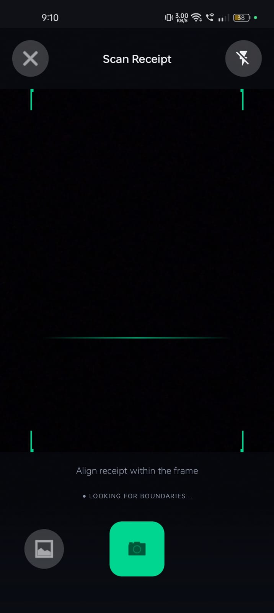

# 📷 SnapBudget OCR

<p align="center">


</p>

<p align="center">
An Android application that uses Optical Character Recognition (OCR) to scan receipts, automatically extract expense details, categorize transactions, and help users manage personal finances efficiently.
</p>

---

# 📖 Overview

**SnapBudget OCR** is an Android application developed using **Kotlin** that simplifies expense management by scanning receipts using **Google ML Kit OCR**. The application extracts key information such as merchant name, transaction date, and total amount, then stores the data securely in a local **Room Database**.

The project minimizes manual data entry while providing an intuitive interface for organizing and tracking daily expenses.

---

# ✨ Features

## 📷 Receipt Scanning

- Scan receipts using OCR
- Capture or upload receipt images
- Automatic text extraction
- Fast and accurate recognition

## 💰 Expense Management

- Automatic expense entry
- Edit extracted information
- Delete transactions
- View expense history

## 📂 Expense Categorization

- Organize expenses
- Category management
- Transaction tracking

## 📊 Analytics

- Expense summaries
- Category-wise spending
- Budget monitoring
- Spending insights

## 📱 User Experience

- Material Design interface
- Offline functionality
- Responsive UI
- Local database storage

---

# 📸 Screenshots

## Application Screens

| Home Screen | Receipt Scanner |
|-------------|-----------------|
|  |  |

| Expense Details | Expense History |
|-----------------|-----------------|
|  |  |

| Dashboard |
|-----------|
|  |

---

# 🔄 Project Workflow

<p align="center">

</p>

---

# 🛠 Tech Stack

| Technology | Purpose |
|------------|---------|
| Kotlin | Android Development |
| Android Studio | IDE |
| Google ML Kit OCR | Text Recognition |
| Room Database | Local Storage |
| Jetpack Components | Android Architecture |
| Material Design | UI Design |

---

# 🏗 Architecture

```text
                User
                  │
                  ▼
         Android Application
                  │
                  ▼
        Capture / Upload Receipt
                  │
                  ▼
         Google ML Kit OCR
                  │
                  ▼
      Extract Receipt Information
                  │
                  ▼
     Merchant • Amount • Date
                  │
                  ▼
         Room Database Storage
                  │
                  ▼
      Expense Dashboard & History
```

---

# 📂 Project Structure

```text
SnapBudget-OCR/
│
├── app/
│   ├── src/
│   ├── build.gradle.kts
│   └── proguard-rules.pro
│
├── images/
│   ├── 1.jpeg
│   ├── 2.jpeg
│   ├── 4.jpeg
│   ├── 5.jpeg
│   ├── 6.jpeg
│   └── pipeline.jpeg
│
├── Receipt Tests/
├── Logs Testing/
├── README.md
└── .gitignore
```

---

# 🚀 Installation

## Clone the Repository

```bash
git clone https://github.com/pralhadchape24/snapbudget-ocr.git
```

```bash
cd SnapBudget-OCR
```

## Open in Android Studio

Open the project using **Android Studio**.

## Sync Gradle

Allow Gradle to download and sync all dependencies.

## Run the Application

- Connect an Android device or start an emulator.
- Click **Run ▶** in Android Studio.

---

# 📌 Core Functionalities

- OCR-Based Receipt Scanning
- Automatic Expense Extraction
- Expense Categorization
- Transaction History
- Room Database Integration
- Offline Expense Tracking
- Budget Management

---

# 📚 Learning Outcomes

This project demonstrates:

- Android Development with Kotlin
- Google ML Kit OCR Integration
- Room Database
- Jetpack Components
- Material Design
- Mobile UI Development
- Local Data Persistence

---

# 🔮 Future Enhancements

- Firebase Authentication
- Cloud Backup & Synchronization
- AI-Based Expense Categorization
- Monthly Budget Reports
- PDF & Excel Export
- Dark Mode
- Multi-language OCR Support
- Currency Conversion
- Expense Analytics Dashboard

---

# 🤝 Contributing

Contributions are welcome!

1. Fork the repository.
2. Create a feature branch:

```bash
git checkout -b feature-name
```

3. Commit your changes:

```bash
git commit -m "Add new feature"
```

4. Push to your branch:

```bash
git push origin feature-name
```

5. Open a Pull Request.

---

# 👨‍💻 Author

**Pralhad Shivaji Chape**

🎓 B.Tech Computer Engineering  
🏫 Vishwakarma Institute of Technology (VIT), Pune

**GitHub:** https://github.com/pralhadchape24

---

# ⭐ Support

If you found this project useful, consider giving it a **⭐ Star** on GitHub.

---

<p align="center">
Made with ❤️ using <b>Kotlin</b>, <b>Android Studio</b>, <b>Google ML Kit OCR</b>, and <b>Room Database</b>.
</p>
